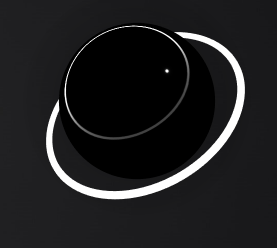

# 🔮 Voice Orb AI

<div align="center">



**A beautiful, voice-reactive AI orb for Windows that lives on your desktop.**

[](https://github.com/pcarras/VoiceOrb/releases)
[](https://www.microsoft.com/windows)
[](LICENSE)

</div>

---

## ✨ Features

- 🎤 **Voice-Reactive Visualization** — The orb responds in real-time to your microphone input with stunning 3D animations
- 🎙️ **Voice-to-Text Transcription** — Hold a hotkey to record, release to transcribe using Groq's Whisper API
- 📋 **Auto-Paste** — Transcribed text is automatically pasted at your cursor position
- 🎨 **visual Presets** — Choose from 5 unique orb styles (Deep Void, Classic Siri, Toxic Sludge, etc.)
- ⚙️ **Fully Customizable** — Adjust size, opacity, shadow intensity, and visual effects
- 🖥️ **Desktop Overlay** — Transparent, always-on-top window that sits on your desktop
- 🎵 **Sound Effects** — Satisfying audio feedback for entry/exit animations
- 🔧 **System Tray Integration** — Minimizes to tray, accessible via right-click menu

---

## 🚀 Installation

### Option 1: Download Installer (Recommended)
1. Download the latest `Voice Orb Setup x.x.x.exe` from [Releases](https://github.com/pcarras/VoiceOrb/releases)
2. Run the installer
3. Launch Voice Orb from your Start Menu

### Option 2: Build from Source
```bash
# Clone the repository
git clone https://github.com/pcarras/VoiceOrb.git
cd VoiceOrb

# Install dependencies
npm install

# Run in development mode
npm start

# Build the installer
npm run dist
```

---

## 🔧 Configuration

### Getting a Groq API Key
1. Go to [console.groq.com](https://console.groq.com)
2. Create a free account
3. Generate an API key
4. Enter the key in Voice Orb's Settings window

### Settings

| Setting | Description | Default |
|---------|-------------|---------|
| **Orb Scale** | Size of the orb (0.3 - 1.5) | 0.4 |
| **Orb Opacity** | Transparency of the orb | 100% |
| **Shadow Opacity** | Intensity of the shadow beneath the orb | 0.4 |
| **Overlay Opacity** | Transparency of the transcription text | 0.4 |
| **Show Transcription** | Display transcribed text on screen | Off |
| **Visual Preset** | Choose from 5 unique orb styles | Deep Void |
| **Shortcut** | Hotkey to start recording | AltGr |

---

## 🎮 Usage

1. **Start the app** — The orb appears on your desktop
2. **Hold the hotkey** (default: `AltGr`) — Recording starts, orb shows visual feedback
3. **Speak** — The orb reacts to your voice
4. **Release the hotkey** — Audio is transcribed and auto-pasted at your cursor

### Controls
- **Right-click on orb** → Open context menu
- **Drag the orb** → Reposition on screen
- **System Tray icon** → Access Settings, Show/Hide, Quit

---

## 🎨 Visual Presets

Voice Orb includes **5 stunning visual presets**:

| Preset | Description |
|--------|-------------|
| 🌌 Deep Void | Dark, ethereal sphere with subtle glow |
| 🔵 Classic Siri | Minimalist sphere with pulsing emissions |
| ☢️ Toxic Sludge | Green, bubbling radioactive surface |
| 🔷 Geometric Low-Poly | Sharp, angular aesthetic with wireframe effects |
| ⚙️ Rusty Machine | Steampunk-style wireframe torus knot |

---

## 🛠️ Tech Stack

- **[Electron](https://www.electronjs.org/)** — Cross-platform desktop app framework
- **[Three.js](https://threejs.org/)** — 3D graphics rendering
- **[Groq API](https://groq.com/)** — Ultra-fast Whisper transcription
- **[uiohook-napi](https://github.com/nicr222/uiohook-napi)** — Global keyboard shortcuts

---

## 📁 Project Structure

```
orb/
├── main.js              # Electron main process
├── voice_orb.html       # Main orb visualization
├── settings.html        # Settings window
├── settings.js          # Settings logic
├── about.html           # About window
├── icon.png             # App icon
└── assets/              # Images and resources
```

---

## 🐛 Known Issues

- **uiohook-napi crash** — Occasionally the app may crash on startup due to a known issue with the keyboard hook library. Simply restart the app.

---

## 📜 License

MIT License — feel free to use, modify, and distribute.

---

## 🙏 Credits

Created with ❤️ by [pcarras](https://github.com/pcarras)

---

<div align="center">

**[⬆ Back to Top](#-voice-orb-ai)**

</div>
